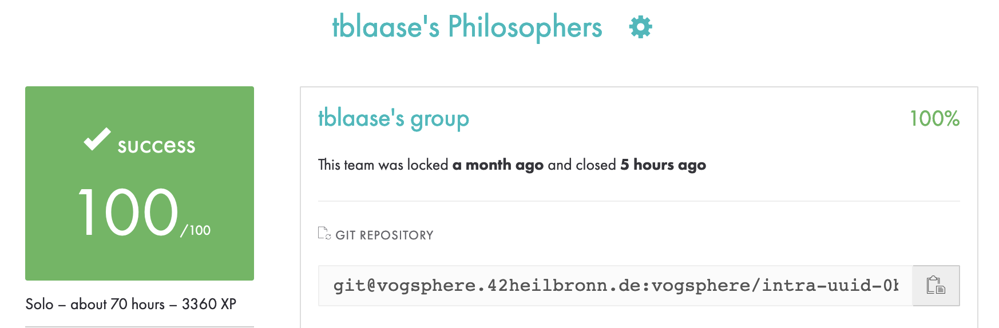
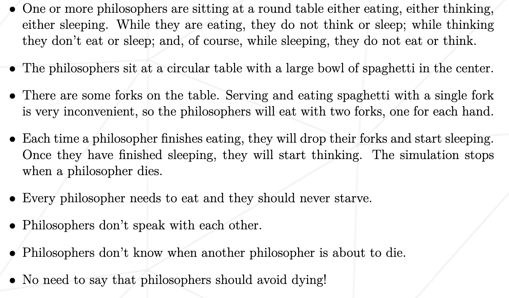
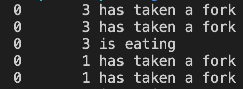
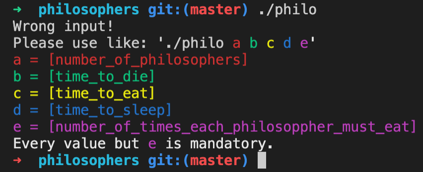

# Philosophers (January 2022, Version 9, 100/100)
I’ve never thought philosophy would be so deadly. 
This is my solution for the philosophers project of 42 school. 
This is part of common core. 
 
 

## Introduction

This is taken from the subject.pdf. 

To run the simulation a few variables are needed:

1. number_of_philosophers: is the number of philosophers and also the number of forks.
2. time_to_die: is in milliseconds, if a philosopher doesn’t start eating ’time_to_die’milliseconds after starting their last meal or the beginning of the simulation,it dies.
3. time_to_eat: is in milliseconds and is the time it takes for a philosopher to eat. During that time they will need to keep the two forks.
4. time_to_sleep: is in milliseconds and is the time the philosopher will spend sleeping.
5. number_of_times_each_philosopher_must_eat: argument is optional, if all philosophers eat at least ’number_of_times_each_philosopher_must_eat’ the simulation will stop. If not specified, the simulation will stop only at the death of a philosopher.
 
Each action of a philosopher will result in his state beeing printed in the correct order and with a timestamp and his number. 
A philosopher can:

- grab a fork
- eat
- sleep
- think
- die

 

## Usage
To compile the programm run `make all` in the root of the project. 
Then run `./philo` with the parameters you want to test explained in [Introduction](https://github.com/tblaase/philosophers#Introduction) as 1. 2. 3. 4. and 5.  
i.e.: `./philo 4 410 200 200 4` 
Now the simulation will start and run until each philosopher has eaten 4 times or dies.  
This `./philo 4 410 200 200` should theoretically run infinite. 
If you want to see the usage while using you can do `./philo` and it will show you the correct usage. 

## Errors
If you find any undefined behaviour with this code, please notify me about it. 
Contact information can be found on my [profile](https://github.com/tblaase).
